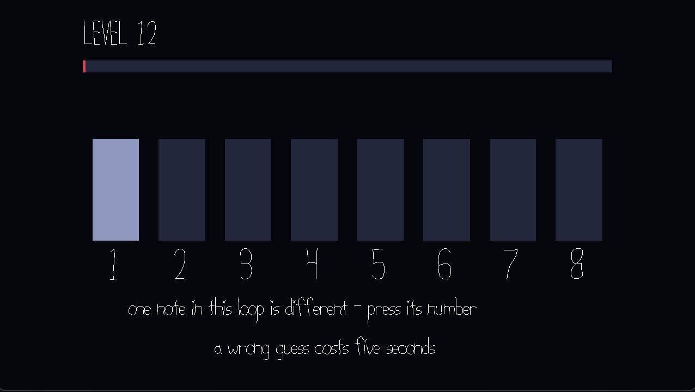

# Odd Note Out

Author: Haoran Xie

Design: A short loop of notes plays over and over on a steady beat and one of
them is different. Pick it out and you move up a level, where the loop is
longer, faster, and the difference is smaller. How many levels you get through
in a minute is the whole game.

Screen Shot:

How To Play:

Press the number of the note that sounds different. The loop keeps going round
while you listen and you answer whenever you are sure.

A run is 60 seconds and the clock never stops. A wrong guess costs five seconds
and takes that note out of the loop. It goes quiet and leaves a rest in its
place, so a six note loop drops to five, and what you can still hear is what is
still in question. Working through the pads one at a time does get you there,
but at five seconds a go it eats the run. Enter starts a new one.

You are never told what kind of different to expect. The odd note might be out
of tune, quieter than the rest, or brighter in tone, and each loop picks one
without saying which. Every pad lights the same way on its beat, so nothing on
screen gives it away.

The first two loops are always out of tune, which is the easiest kind to hear.
After that the loop grows from four notes to six and then eight, the beat
quickens from 0.4 to 0.26 seconds, and an out of tune note closes in from most
of a semitone to thirty cents. The level in the corner is the score and the
difficulty at the same time.

Credits:

Built from the 15-466-f26-base3 code. The Load<> blocks, the draw() scaffolding
and the shadowed text in PlayMode.cpp are based on the base code's PlayMode.cpp.
Text is drawn with the base code's PathFont, which is Jim McCann's public domain
font from Chesskoban. DrawQuads.cpp does for filled rectangles what the base
code's DrawLines.cpp does for line segments and is based on it, which is noted
in both of its files. Two smaller things are credited inline in PlayMode.cpp:
the sRGB gamma from Wikipedia and the SDL3 keycode ordering from the SDL3 wiki.

Every sound is mine, synthesized in Tones.cpp when the game loads. A note is a
fundamental plus two harmonics under an exponential decay. The harmonic weights
are normalized so that a brighter note is not also a louder one, since loudness
is one of the differences you have to be able to hear on its own. There are no
recordings, sample packs or third party art here, and no meshes either, since
the whole game is rectangles and text. The hexapod scene and sounds that came
with the base code are still in dist/ but nothing loads them.

This game was built with [NEST](NEST.md).
